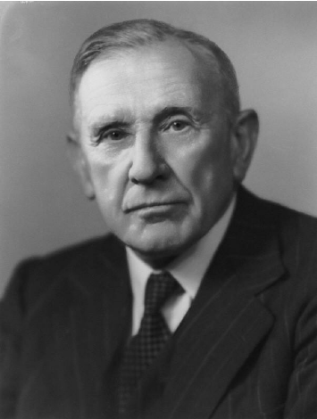

# hurst_exponent

  

Harold Edwin Hurst (1 January 1880 – 7 December 1978) was a British hydrologist from Leicester. Hurst's (1951) study on measuring the long-term storage capacity of reservoirs documented the presence of long-range dependence in hydrology, especially concerning the fluctuations of the water level in the Nile River. In doing so, he developed the empirical rescaled range methodology for measuring long-range dependence. Much of Hurst's research was motivated by his empirical observations of the Nile. The Hurst exponent, which has been used in other fields, such as finance and cardiology, was named after him.

The Hurst exponent is used as a measure of long-term memory of time series. It relates to the autocorrelations of the time series, and the rate at which these decrease as the lag between pairs of values increases.

In fractal geometry, the generalized Hurst exponent has been denoted by H or Hq in honor of both Harold Edwin Hurst and Ludwig Otto Hölder (1859–1937) by Benoît Mandelbrot (1924–2010). H is directly related to fractal dimension, D, and is a measure of a data series "mild" or "wild" randomness.

---

This implementation was inspired by lectures given by Professor Ricieri from ITA on the topic of Big Data and Machine Learning, presented at *Museu da Matemática*.
